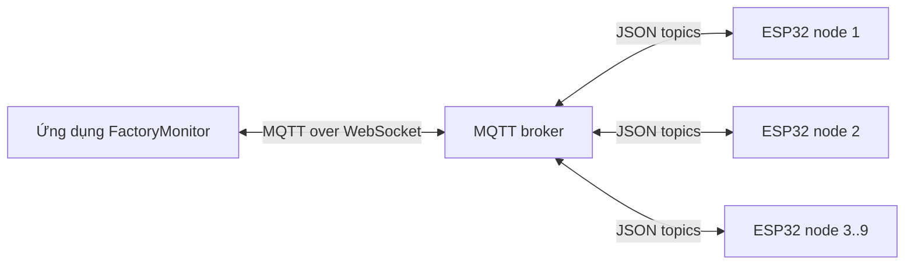

# FactoryMonitor

Ứng dụng Expo/React Native dùng để giám sát và điều khiển các node ESP32 trong hệ thống an toàn môi trường công nghiệp. Ứng dụng nhận dữ liệu cảm biến qua MQTT, hiển thị trạng thái theo thời gian thực và gửi lệnh điều khiển về đúng node.

## Chức năng chính

- Theo dõi nhiệt độ, độ ẩm, mức khí gas và trạng thái kết nối của nhiều node.
- Hiển thị cảnh báo và trạng thái relay theo thời gian thực.
- Bật/tắt relay, tắt còi tạm thời hoặc tắt còi cứng từ ứng dụng.
- Cấu hình ngưỡng cảnh báo và lịch bật/tắt relay.
- Đồng bộ thời gian từ điện thoại xuống node không có RTC.
- Tự đánh dấu node offline khi quá thời gian nhận dữ liệu.

## Kiến trúc



Thông tin chi tiết về topic, gói dữ liệu và các thư mục nằm trong [tài liệu kiến trúc](docs/ARCHITECTURE.md).

## Bắt đầu nhanh

Yêu cầu: Node.js LTS và npm.

```bash
npm install
npm start
```

Sau khi Expo khởi động, chọn Android, iOS hoặc Web. Trong tab **Hệ thống**, nhập địa chỉ MQTT broker sử dụng WebSocket rồi bấm kết nối.

Các lệnh hữu ích:

```bash
npm run android
npm run ios
npm run web
npm run typecheck
```

## Cấu hình MQTT

Cấu hình mặc định nằm tại `src/constants/mqtt.ts` và dùng HiveMQ public broker để thử nghiệm:

```text
wss://broker.hivemq.com:8884/mqtt
```

Broker công khai không phù hợp với dữ liệu thật hoặc môi trường sản xuất. Khi triển khai, hãy dùng broker riêng có TLS, xác thực và phân quyền topic; không ghi username/password trực tiếp vào mã nguồn.

## Cấu trúc thư mục

```text
.
├── App.tsx                 # Điểm vào ứng dụng
├── docs/
│   └── ARCHITECTURE.md     # Luồng dữ liệu và giao thức MQTT
├── src/
│   ├── components/         # Thành phần giao diện tái sử dụng
│   ├── constants/          # Theme và cấu hình MQTT
│   ├── navigation/         # Điều hướng 4 tab
│   ├── screens/            # Giám sát, hẹn giờ, ngưỡng, hệ thống
│   ├── services/           # MQTT và đồng bộ thời gian
│   ├── store/              # Trạng thái ứng dụng bằng Zustand
│   └── types/              # Kiểu gói tin giữa app và ESP32
├── package.json
└── tsconfig.json
```

## Ghi chú

- Ứng dụng hỗ trợ node ID từ 1 đến 9.
- Firmware ESP32 cần publish/subscribe đúng topic và cấu trúc JSON mô tả trong tài liệu kiến trúc.
- Repository chỉ chứa mã nguồn ứng dụng.
